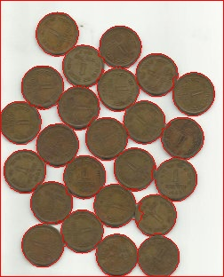

<h1> PROBLEM </h1>
<h2> COIN DETECTION WITH CENTROID</h2>

<br>

<h3><b>Example:</b></h3><br>
<br>
<h4><b>Input: </b></h4>


<br>

```
<h4><b>SCRIPT:</b></h4> 

pip install -r requirements.txt
python coin_toss.py

```

<h4><b>Output: </b></h4>


<br>


