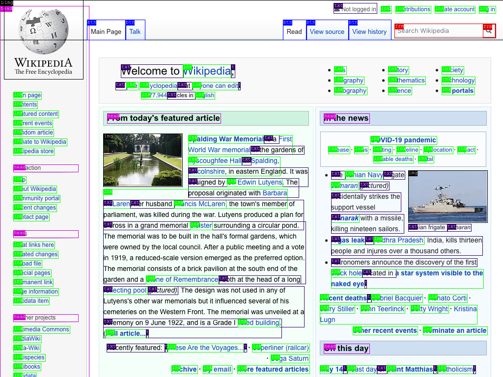

# Deep_Learning
<h1>Website Screenshots Dataset</h1>
<a target="_blank" href="https://public.roboflow.com/object-detection/website-screenshots"> Link for the dataset </a> 

<h2>About This Dataset:</h2>

The Roboflow Website Screenshots dataset is a synthetically generated dataset composed of screenshots from over 1000 of the world's top websites. They have been automatically annotated to label the following classes:

    button - navigation links, tabs, etc.
    heading - text that was enclosed in <h1> to <h6> tags.
    link - inline, textual <a> tags.
    label - text labeling form fields.
    text - all other text.
    image - , <svg>, or <video> tags, and icons.
    iframe - ads and 3rd party content.

<b>Example:</b>

This is an example image and annotation from the dataset:
   

<b>Usage:</b>

Annotated screenshots are very useful in Robotic Process Automation. But they can be expensive to label. This dataset would cost over $4000 for humans to label on popular labeling services.

<b>custom_object_detection:</b>

I've trained this model with YOLOv4 darknet implemetation.

below, I've attached sample output results.  

  

